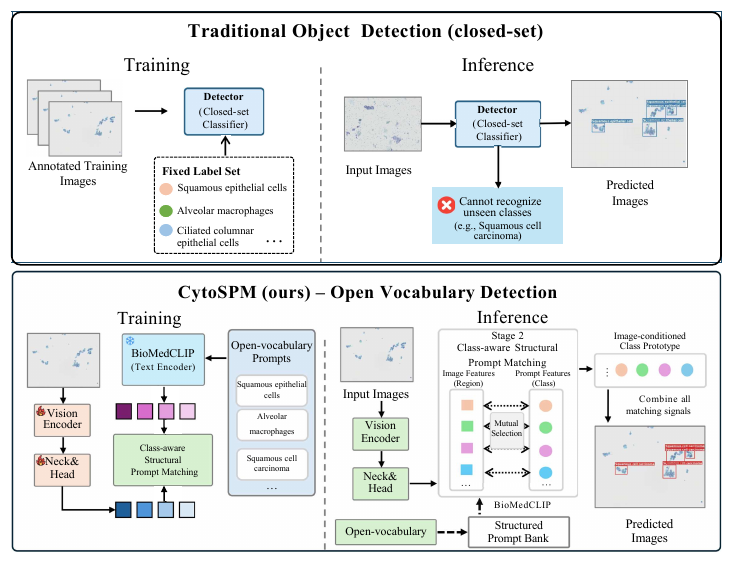
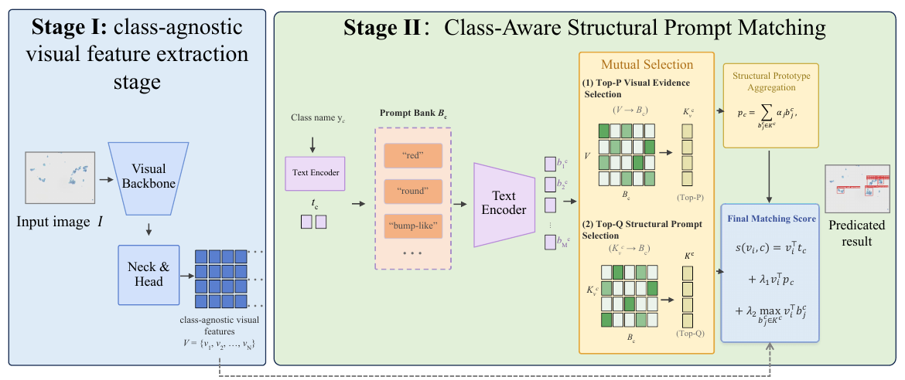
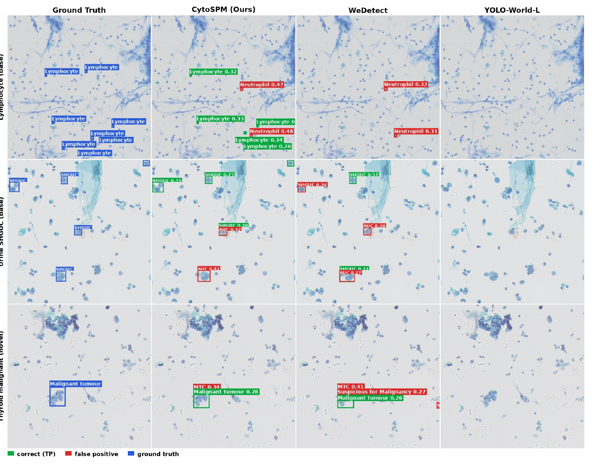

# CytoSPM: Open-Vocabulary Cytopathology Detection with Structured Prompt Bank

[](https://arxiv.org/abs/2609.31314)
[](LICENSE)

Official repository of **CytoSPM** and the **PentaCyto** benchmark (BIBM 2026).

> **CytoSPM: Open-Vocabulary Cytopathology Detection with Structured Prompt Bank**
> Wenjie Li\*, Zishan Xu\*, Jinyang Huang, Zhengxin Nie, Shichao Kan, Yixiong Liang†
> Central South University, Shanghai Jiao Tong University
> *IEEE International Conference on Bioinformatics and Biomedicine (BIBM), 2026*
> [[arXiv]](https://arxiv.org/abs/2609.31314)
>
> \* Equal contribution. † Corresponding author.

<p align="center">
  
</p>

## Abstract

Cytopathology detection requires open-vocabulary recognition because cellular categories are fine-grained, long-tailed, and continuously evolving across different organ systems. However, existing cytology detectors are mostly single-domain and closed-set, and there is still no unified benchmark for evaluating open-vocabulary cytopathology detection.

We present **PentaCyto**, a multi-domain benchmark covering cervical, urinary, respiratory, serous fluid, and thyroid cytology, with 24 base categories and 9 held-out novel categories. Each category is associated with structured cytomorphology prompts that describe diagnostic morphological attributes and provide clinically grounded textual knowledge.

We further propose **CytoSPM**, an efficient detector based on a decoupled two-stage design. It first extracts reusable class-agnostic visual representations, and then performs class-aware structural prompt matching with class names and cytomorphology prompts. On PentaCyto, CytoSPM outperforms existing methods in novel-category detection and open-vocabulary detection while maintaining efficient inference.

## News

- **2026-09**: Paper released on [arXiv](https://arxiv.org/abs/2609.31314).
- **TODO**: Code, pretrained weights, structured prompt bank, and PentaCyto annotations will be released here.

## PentaCyto Benchmark

PentaCyto covers five cytology domains labelled according to their clinical reporting systems. See [`docs/pentacyto.md`](docs/pentacyto.md) for full statistics, category splits, and the evaluation protocol.

| Domain       | Standard | Base categories | Novel categories | Images (base / novel) | Boxes (base / novel) |
|--------------|----------|----------------:|-----------------:|----------------------:|---------------------:|
| Cervical     | TBS      | 9               | –                | 34,305 / –            | 123,474 / –          |
| Urinary      | Paris    | 3               | –                | 25,720 / –            | 8,410 / –            |
| Respiratory  | PSC      | 6               | 3                | 50,102 / 2,593        | 611,320 / 3,517      |
| Serous fluid | TIS      | 1               | 3                | 4,187 / 6,213         | 19,705 / 17,445      |
| Thyroid      | Bethesda | 5               | 3                | 40,719 / 2,656        | 149,172 / 8,250      |
| **Total**    |          | **24**          | **9**            | **155,033 / 11,462**  | **912,081 / 29,212** |

<p align="center">
  
</p>

## Method

CytoSPM is a decoupled two-stage framework:

1. **Stage I – Class-agnostic visual feature extraction.** A ConvNeXt-T backbone with neck and head produces region-level features using only the visual branch, with no class names, text prompts, or cross-modal fusion. These features are reusable across categories and prompt sets.
2. **Stage II – Class-aware structural prompt matching.** Class names and structured cytomorphology prompts are encoded by a frozen BioMedCLIP text encoder. A mutual-selection mechanism picks category-relevant visual regions (Top-P) and visually supported prompts (Top-Q), which are aggregated into an image-conditioned structural prototype. The final score combines class-name matching, structural prototype matching, and fine-grained attribute matching.

<p align="center">
  
</p>

## Main Results on PentaCyto

| Method          | Backbone      | #Params | FPS  | Base AP | Base AP50 | Base AP75 | Novel AP  | Novel AP50 | Novel AP75 | AP<sub>AVG</sub> |
|-----------------|---------------|--------:|-----:|--------:|----------:|----------:|----------:|-----------:|-----------:|-----------------:|
| GLIP            | Swin-T        | 231.8M  | 7.1  | 28.90   | 43.50     | 32.70     | 12.10     | 16.90      | 14.10      | 20.50            |
| Grounding DINO  | Swin-T        | 173.5M  | 6.2  | 30.40   | 47.50     | 33.80     | 2.80      | 4.30       | 3.30       | 16.60            |
| OV-DEIM         | DINOv3-ViT-T  | 11.4M   | 23.2 | 31.60   | 45.50     | 37.20     | 12.70     | 17.00      | 14.80      | 22.15            |
| YOLOE (text)    | YOLOv8-L      | 51.2M   | 75.3 | 33.60   | 48.30     | 39.10     | 6.40      | 8.80       | 7.40       | 20.00            |
| YOLOE (visual)  | YOLOv8-L      | 51.2M   | 75.3 | 29.70   | 43.10     | 34.30     | 12.50     | 16.90      | 14.90      | 21.10            |
| YOLOE (mixed)   | YOLOv8-L      | 51.2M   | 75.3 | 32.80   | 47.40     | 38.00     | 11.50     | 15.60      | 13.60      | 22.15            |
| YOLO-World-L    | YOLOv8-L      | 110.5M  | 25.7 | 32.40   | 48.20     | 37.50     | 13.70     | 18.30      | 15.80      | 23.05            |
| LLMDet          | Swin-T        | 173.0M  | 6.6  | 33.80   | 50.90     | 38.40     | 7.60      | 10.90      | 8.90       | 20.70            |
| MedROV          | YOLOv8-L      | 51.6M   | 52.2 | 27.96   | 39.25     | 32.66     | 3.62      | 4.76       | 4.03       | 15.79            |
| WeDetect        | ConvNeXt-T    | 37.9M   | 34.3 | 33.37   | 51.43     | 38.15     | 13.30     | 18.98      | 15.34      | 23.34            |
| **CytoSPM**     | ConvNeXt-T    | 37.9M   | 25.8 | 33.55   | **52.20** | 38.17     | **15.00** | **21.00**  | **17.20**  | **24.27**        |

<p align="center">
  
</p>

## Repository Structure

```
CytoSPM/
├── assets/          # figures
├── configs/         # training / evaluation configs (coming soon)
├── cytospm/         # model code (coming soon)
├── data/PentaCyto/  # dataset root and category splits
├── docs/            # benchmark documentation
└── tools/           # train / test scripts (coming soon)
```

## Installation, Training and Evaluation

Coming soon.

## Citation

If you find this work useful, please cite:

```bibtex
@inproceedings{li2026cytospm,
  title     = {CytoSPM: Open-Vocabulary Cytopathology Detection with Structured Prompt Bank},
  author    = {Li, Wenjie and Xu, Zishan and Huang, Jinyang and Nie, Zhengxin and Kan, Shichao and Liang, Yixiong},
  booktitle = {IEEE International Conference on Bioinformatics and Biomedicine (BIBM)},
  year      = {2026}
}

@article{li2026cytospm_arxiv,
  title   = {CytoSPM: Open-Vocabulary Cytopathology Detection with Structured Prompt Bank},
  author  = {Li, Wenjie and Xu, Zishan and Huang, Jinyang and Nie, Zhengxin and Kan, Shichao and Liang, Yixiong},
  journal = {arXiv preprint arXiv:2609.31314},
  year    = {2026}
}
```

## License

This project is released under the [Apache 2.0 License](LICENSE).

## Acknowledgements

CytoSPM builds upon WeDetect and [BioMedCLIP](https://github.com/microsoft/BiomedCLIP). We thank the authors for their open-source contributions.
