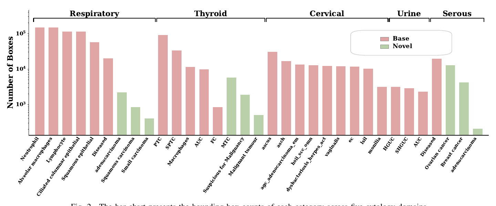

# PentaCyto Benchmark

PentaCyto is a multi-domain cytopathology detection benchmark with an
open-vocabulary evaluation protocol. It covers five cytology domains, each
labelled according to its clinical reporting system, and splits the 33
diagnostic categories into **24 base** categories (training / validation /
base testing) and **9 novel** categories that are completely held out from
training and used only for open-vocabulary evaluation.

Bounding boxes were annotated by eight experts with medical backgrounds,
followed by cross-review to reduce missed annotations, incorrect labels, and
confusion among fine-grained categories.

## Statistics

| Domain       | Standard | Base # Cat. | Base # WSI | Base # Images | Base # Boxes | Novel # Cat. | Novel # WSI | Novel # Images | Novel # Boxes |
|--------------|----------|------------:|-----------:|--------------:|-------------:|-------------:|------------:|---------------:|--------------:|
| Cervical     | TBS      | 9           | 1,588      | 34,305        | 123,474      | –            | –           | –              | –             |
| Urinary      | Paris    | 3           | 220        | 25,720        | 8,410        | –            | –           | –              | –             |
| Respiratory  | PSC      | 6           | 162        | 50,102        | 611,320      | 3            | 20          | 2,593          | 3,517         |
| Serous fluid | TIS      | 1           | 10         | 4,187         | 19,705       | 3            | 16          | 6,213          | 17,445        |
| Thyroid      | Bethesda | 5           | 261        | 40,719        | 149,172      | 3            | 15          | 2,656          | 8,250         |
| **Total**    |          | **24**      | **2,241**  | **155,033**   | **912,081**  | **9**        | **51**      | **11,462**     | **29,212**    |

<p align="center">
  
</p>

## Category Splits

| Domain       | Base categories                                                                                                       | Novel categories                                        |
|--------------|-----------------------------------------------------------------------------------------------------------------------|---------------------------------------------------------|
| Respiratory  | Neutrophil, Alveolar macrophages, Lymphocyte, Ciliated columnar epithelial, Squamous epithelial, Diseased              | Adenocarcinoma, Squamous carcinoma, Small cell carcinoma |
| Thyroid      | PTC, SPTC, Macrophages, AUC, FC                                                                                       | MTC, Suspicious for Malignancy, Malignant tumour        |
| Cervical     | ASC-US, ASC-H, AGC / adenocarcinoma / EM, HSIL / SCC / OMN, dysbacteriosis / herpes / ACT, vaginalis, EC, LSIL, monilia | –                                                       |
| Urinary      | HGUC, SHGUC, AUC                                                                                                      | –                                                       |
| Serous fluid | Diseased                                                                                                              | Ovarian cancer, Breast cancer, Adenocarcinoma           |

The machine-readable split files live in
[`data/PentaCyto/splits/`](../data/PentaCyto/splits/). The structured
cytomorphology prompt bank will be released together with the code.

## Directory Layout

```
data/PentaCyto/
├── cervical/
│   ├── images/
│   └── annotations/{train,val,test}.json      # COCO format
├── urinary/
├── respiratory/
├── serous/
├── thyroid/
└── splits/
    ├── base_categories.json
    └── novel_categories.json
```

## Evaluation Protocol

- **Base split**: models are trained on the 24 base categories and evaluated
  on the base test set.
- **Novel split**: the 9 novel categories (and all images containing them)
  are excluded from training. At test time only the class-name embeddings and
  the corresponding prompt banks are replaced; detector weights stay fixed.
- **Metrics**: AP, AP50 and AP75 on each split, plus AP<sub>AVG</sub>, the
  mean of base AP and novel AP.

## Download

Download links and preprocessing scripts will be released here.
